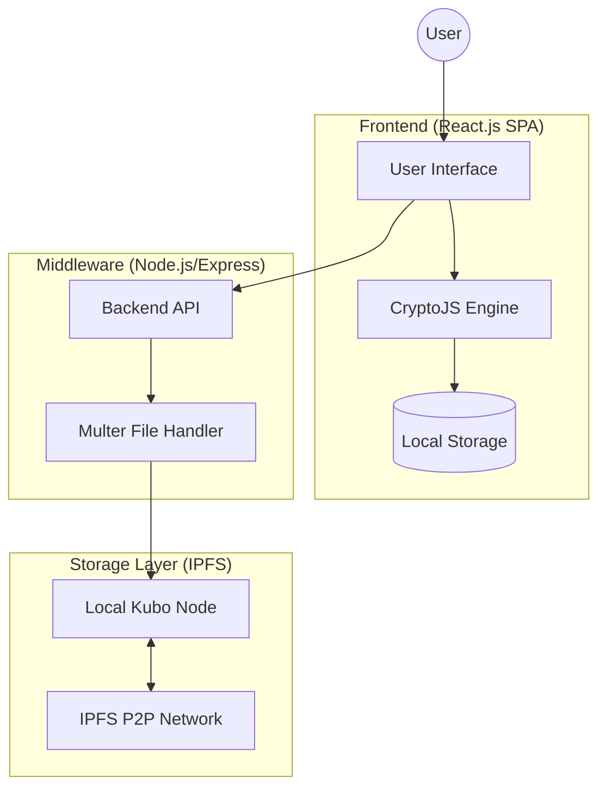

# Comprehensive Technical Report: Decentralized File Storage using IPFS

## 1. Project Overview
This project is a **Decentralized File Storage Application** built using **IPFS (InterPlanetary File System)**. It addresses the vulnerabilities of centralized cloud storage (Single Point of Failure, data privacy concerns, and censorship) by distributing data across a peer-to-peer network.

### 1.1 Core Objectives
- **Decentralization**: Eliminate central server dependency.
- **Security**: Implement client-side AES-256 encryption.
- **Persistence**: Leverage IPFS content-addressing for immutable storage.
- **User Experience**: Provide a modern, responsive web interface for managing decentralized assets.

---

## 2. System Architecture

The application follows a **three-tier architecture** designed for decentralization.

### 2.1 Architecture Diagram

### 2.2 Component Breakdown
1.  **React Frontend**: A Single Page Application (SPA) that handles user interactions, client-side encryption, and state management.
2.  **Node.js Backend**: A proxy server that interfaces between the frontend and the local IPFS node. It provides endpoints for uploading (`/upload`) and downloading (`/download`).
3.  **IPFS (Kubo)**: The underlying storage protocol. The backend communicates with Kubo via the `ipfs-http-client` library.

---

## 3. Full Feature Implementation

### 3.1 Decentralized File Upload
- **Logic**: Files are uploaded through a `FormData` object. The backend receives the file, adds it to IPFS, and returns a unique **CID (Content Identifier)**.
- **Preservation of Metadata**: To preserve filenames (which are lost in raw IPFS hashes), the system use the `wrapWithDirectory` option. This creates a directory structure `CID/filename`.

### 3.2 Client-Side AES-256 Encryption
- **Process**:
    1.  File is read into memory as a **DataURL**.
    2.  A JSON payload is created containing the file name, MIME type, and data.
    3.  The payload is encrypted using **AES-256** (via `CryptoJS`) with a user-provided password.
    4.  The resulting encrypted string is uploaded as a `.encrypted` text file to IPFS.
- **Security**: The decryption password is never sent to the backend; it only exists in the client's RAM during the process.

### 3.3 Secure Vault & Recent History
- **LocalStorage Integration**: The app maintains a registry of uploaded CIDs and metadata in the browser's `localStorage`.
- **Vault Module**: Allows users to "bookmark" encrypted files. Since the password is not stored, the user must provide it again to decrypt and view the file.

### 3.4 Interactive Gallery & Previews
- **Multi-format Support**: Integrated previews for:
    - **Images**: PNG, JPG, GIF, WebP.
    - **Video**: MP4, WebM.
    - **Documents**: PDF (via iframe).
    - **Audio**: MP3, WAV.
- **Decryption-on-the-fly**: For encrypted files in the gallery, the system fetches the encrypted blob, decrypts it in the browser, creates a `Blob URL`, and renders it.

---

## 4. Technical Stack

| Component | Technology | Purpose |
| :--- | :--- | :--- |
| **Frontend** | React.js 18 | UI Layer & State Management |
| **Styling** | Vanilla CSS (Glassmorphism) | Modern, responsive aesthetics |
| **Encryption** | CryptoJS | AES-256 Client-side encryption |
| **Routing** | React Router Dom v6 | Multi-page navigation |
| **Backend** | Node.js & Express | Proxy between Client and IPFS |
| **Storage** | IPFS (Kubo go-ipfs) | P2P storage network |
| **File Handling** | Multer | Server-side multipart/form-data processing |

---

## 5. Security Architecture

### 5.1 Data Privacy Flow (Encrypted Mode)
1.  **Extraction**: `FileReader` extracts raw bits from the file.
2.  **Transformation**: Bits are converted to Base64 (DataURL).
3.  **Encryption**: `CryptoJS.AES.encrypt(metadata + Base64, secret)`.
4.  **Distribution**: Encrypted payload is sent to IPFS.
5.  **Result**: Even if the CID is public, the content is unintelligible without the secret key.

---

## 6. Implementation Challenges & Solutions

| Challenge | Solution |
| :--- | :--- |
| **Loss of Filenames in IPFS** | Used `wrapWithDirectory` in the backend so queries return a directory containing the file with its original name. |
| **Direct Browsing Lag** | Implemented a preview system that converts IPFS streams into browser-native `Blob` objects for smoother rendering. |
| **State Persistence** | Leveraged `localStorage` to keep track of user uploads across sessions without needing a centralized database. |

---

## 7. Future Scope for Research (Journal/Survey Paper)
- **Blockchain Integration**: Implementing Smart Contracts (Ethereum/Polygon) to store CIDs on-chain for verifiable ownership.
- **Multi-Signature Access**: Using threshold cryptography for shared file access.
- **Dynamic Content Support**: Researching IPNS (InterPlanetary Name System) for mutable file pointers.
- **Performance Benchmarking**: Comparing latency between Centralized (AWS S3) vs. Decentralized (IPFS) across different geographic regions.
